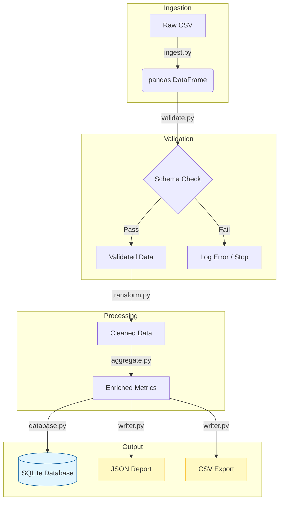

# NYC Airbnb Data Pipeline


A batch ETL pipeline for ingesting, cleaning, aggregating, and exporting NYC Airbnb listings data.

## Key Features
- **Robust ETL**: Full cycle from raw CSV to structured SQL storage.
- **Data Validation**: Schema enforcement to prevent pipeline crashes.
- **Automated Aggregation**: Calculating neighborhood-level metrics on the fly.
- **SQL Integration**: Persistent storage using SQLAlchemy and SQLite.
- **Test-Driven**: Comprehensive unit tests with `pytest`.

## Table of Contents
- [Pipeline Architecture](#pipeline-architecture)
- [Project Structure](#project-structure)
- [Database Integration](#database-integration)
- [How to Run](#how-to-run)
- [Tests](#tests)

## Pipeline Architecture


## Dataset

The project uses the NYC Airbnb 2023 dataset in CSV format.

Source data includes information about:
- listings
- hosts
- neighbourhoods
- prices and availability

The dataset contains ~43,000 rows and fits into memory.

## Project structure

- `ingest.py` — CSV ingestion layer  
- `validate.py` — Schema and data validation  
- `transform.py` — Data cleaning and transformation  
- `aggregate.py` — Aggregation logic  
- `writer.py` — Output writing layer  
- `errors.py` — Custom exceptions  
- `logger.py` — Logging configuration  
- `config.py` — Pipeline configuration  
- `pipeline.py` — Pipeline orchestrator  
- `main.py` — Pipeline entry point  
- `tests/` — Unit tests  
- `data/` — Source and output files
- `check_db.py` - Utility script to verify data integrity and types in the SQLite database.

## Pipeline overview

The pipeline consists of the following steps:

1. **Ingestion**
   - Reads raw CSV data into a pandas DataFrame
   - Handles missing or unreadable source files
   - Logs ingestion events

2. **Validation**
   - Checks required columns and basic data constraints
   - Fails fast if schema expectations are violated

3. **Transformation**
   - Cleans and standardizes raw data
   - Fills missing textual fields with default values
   - Filters invalid rows (negative prices, invalid availability)
   - Removes low-variance or unusable columns
   - Converts columns to expected data types

4. **Aggregation**
   - Computes neighbourhood-level price metrics:
     - average price
     - minimum and maximum price
     - number of listings
   - Enriches listing-level data with aggregated metrics
   - Calculates price difference from neighbourhood average

5. **Writing**
   - Writes the final dataset to:
     - JSON (newline-delimited)
     - CSV

## Sample Output

To give you an idea of the processed data, here are snippets of the output:

### 1. Listing Data with Aggregated Metrics (JSON)
Each row is enriched with neighborhood-level statistics during the aggregation step:
```json
{
  "id": 2539,
  "name": "Clean & quiet apt home by the park",
  "neighbourhood": "Kensington",
  "price": 149,
  "avg_price_neighbourhood": 132.5,
  "price_diff_from_avg": 16.5
}
```

## Database Integration

The pipeline includes a SQL persistence layer to demonstrate production-ready data storage:
- **Engine**: SQLAlchemy for robust database communication.
- **Database**: SQLite (file-based), which allows for easy result inspection without complex setup.
- **Functionality**: Automatically creates/updates tables and loads cleaned, aggregated data.

### Verification
To ensure data was saved correctly and types (especially dates) were preserved, run:
```bash
python check_db.py
```

This script reads data back from the database and prints its schema and row count.

```
--- Database Integrity Check ---
Total rows in 'listings': 43214
Data Types:
id                           int64
name                        object
price                        int64
last_review         datetime64[ns]
avg_price_neigh            float64
dtype: object

Sample Date: 2023-12-31 00:00:00 | Type: <class 'pandas._libs.tslibs.timestamps.Timestamp'>
```

## Configuration

Pipeline behaviour is controlled via a configuration dictionary, including:

- source file path
- required columns and expected data types
- output path

This allows the pipeline to be easily adapted to other datasets with similar structure.

## Error handling and logging

The pipeline includes:
- custom exception classes for ingestion, validation and transformation errors
- structured logging for key pipeline steps

This makes failures explicit and easier to debug.

## Tests

Unit tests cover:
- ingestion logic
- validation logic
- transformation correctness
- aggregation correctness
- output file generation
- saving to database

Tests are written using pytest.

To run tests:
```bash
pytest
```

## How to run

1. Install dependencies:
```bash
pip install -r requirements.txt
```

2. Configure environment:
Copy `.env.example` to `.env` and configure your DATABASE_URL

3. Run the pipeline:
```
python main.py
```

4. Verify the database results
```
python check_db.py
```

The pipeline will:

 - read data/NYC-Airbnb-2023.csv
 - validate and transform data
 - compute aggregate metrics
 - save data into database
 - write output JSON and CSV into data/output/

## Notes

- The pipeline is designed for datasets that fit into memory.
- For larger-than-memory datasets, chunk-based or database-backed approaches would be required.

## Data quality

The dataset may contain missing or inconsistent values.
The pipeline validates and cleans these issues before further processing.

## Purpose

This project demonstrates:
- batch data pipeline design
- pandas-based data transformation and aggregation
- configuration-driven processing
- testing, logging, and error handling

## Future improvements

- processing large datasets in chunks
- orchestration via Airflow